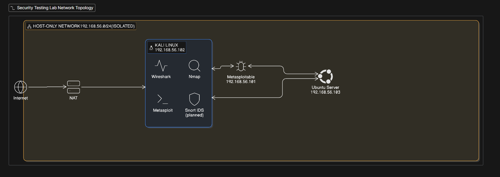
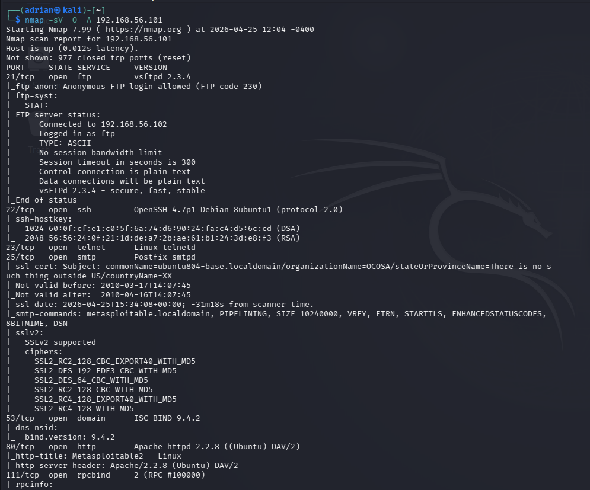
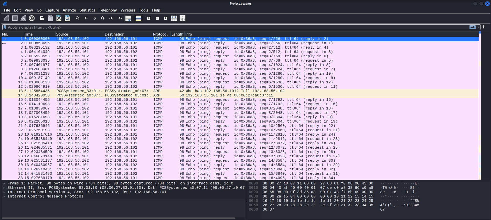
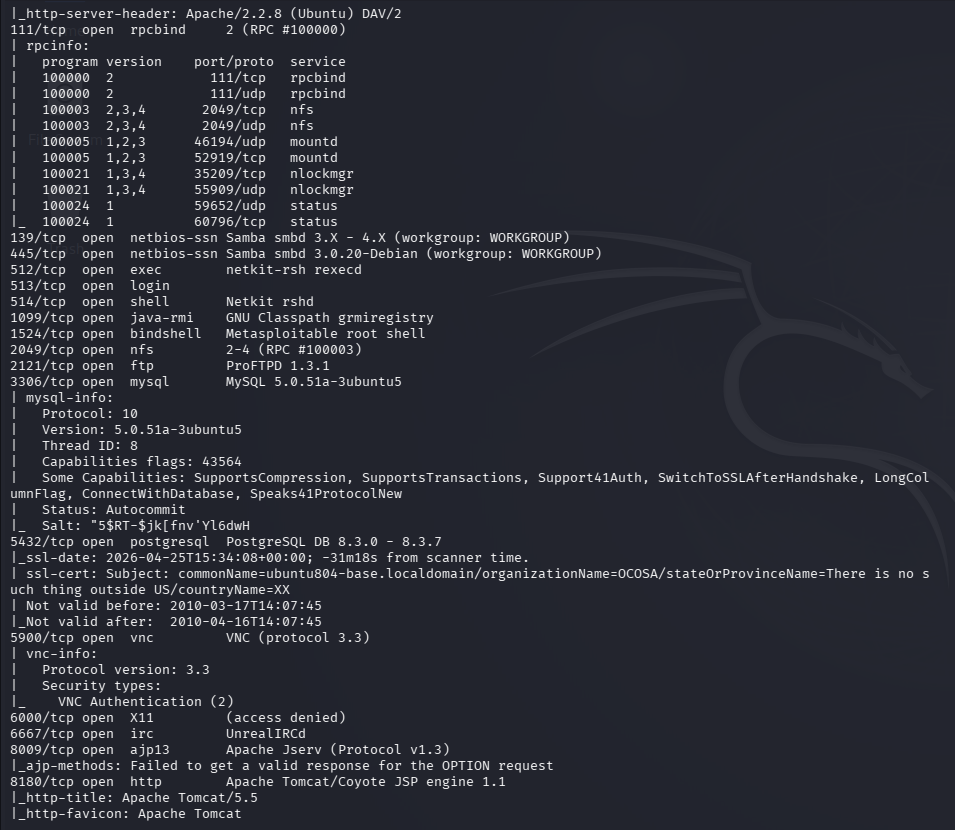
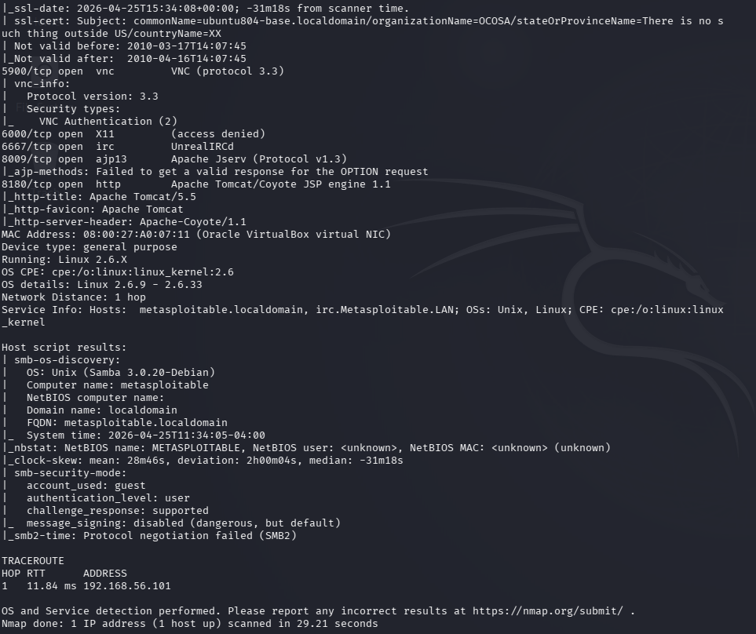
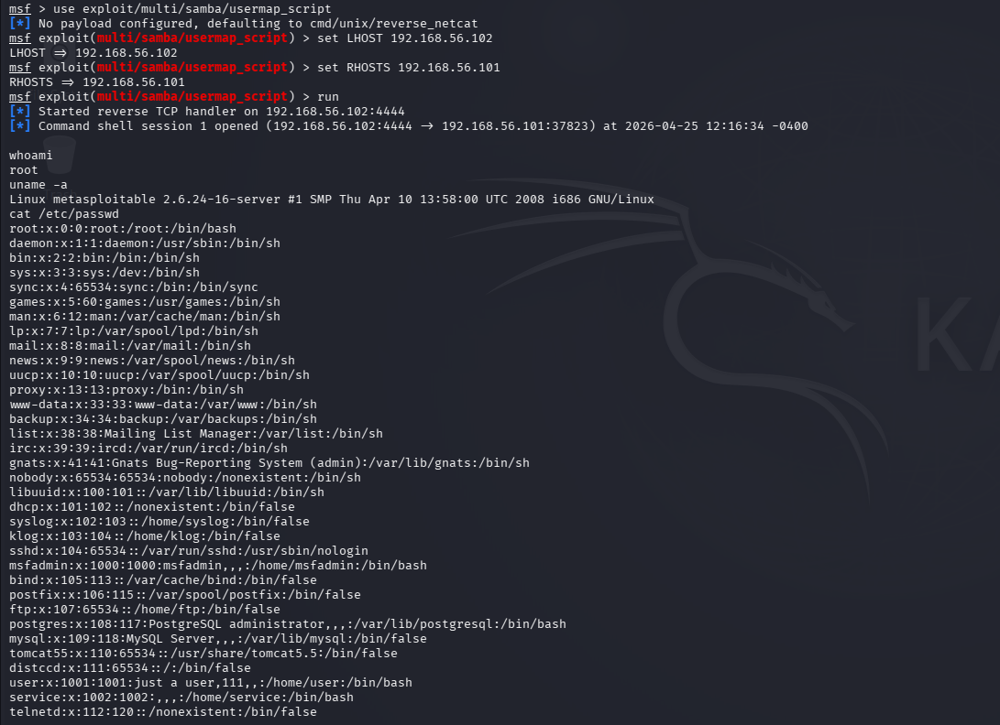
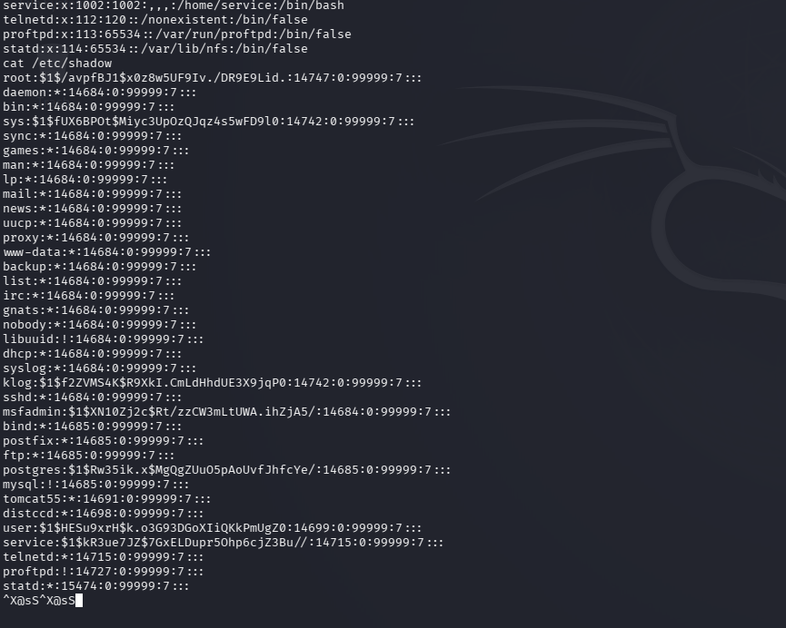
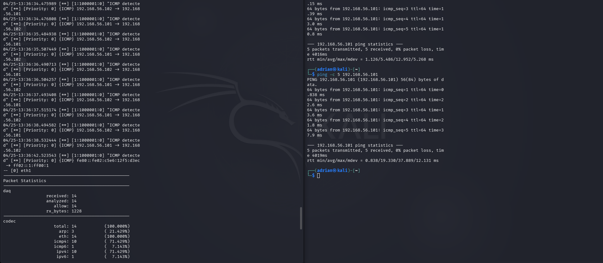
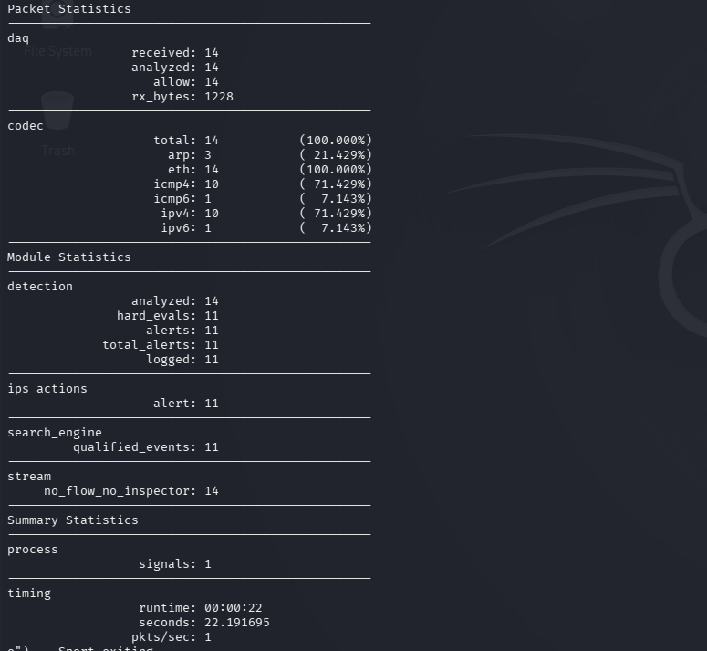

# Cybersecurity HomeLab

A hands-on cybersecurity home lab built to simulate real-world attack and defense scenarios using virtualized environments.

---

## Network Architecture

| Machine | OS | IP Address | Role |
|---|---|---|---|
| Kali Linux | Debian-based | 192.168.56.102 | Attacker |
| Metasploitable 2 | Ubuntu 8.04 | 192.168.56.101 | Vulnerable Target |
| Ubuntu Server | Ubuntu 24.04 | 192.168.56.103 | Realistic Target |

All VMs are connected via a **Host-Only network** (isolated from the internet) inside VirtualBox.

---

### Network Reconnaissance
- Configured isolated lab network with 3 virtual machines
- Performed full Nmap scan with OS detection and service versioning
- Captured and analyzed network traffic with Wireshark (ICMP, ARP, TCP)

| Nmap Scan | Wireshark Capture |
|---|---|
|  |  |
|  | |
|  | |

---

### Vulnerability Assessment & Exploitation
- Identified 23 open ports and critical services on Metasploitable 2
- Exploited **CVE-2007-2447** (Samba usermap_script) using Metasploit Framework
- Obtained **root shell** on target system
- Accessed `/etc/passwd` and `/etc/shadow` — full system compromise demonstrated

| Metasploit Exploit | Root Shell + /etc/shadow |
|---|---|
|  |  |

---

### Network Defense
- Deployed **Snort IDS 3.12** with custom ICMP detection rules
- Simulated attack detected in real time — **11 alerts** on 14 analyzed packets
- Configured iptables firewall rules on Ubuntu Server

| Snort Alerts | Snort Statistics |
|---|---|
|  |  |

---

## Key Findings

| CVE | Service | Severity | Impact |
|---|---|---|---|
| CVE-2007-2447 | Samba 3.0.20 | **CRITICAL (10.0)** | Remote Code Execution → Root |
| CVE-2011-2523 | vsftpd 2.3.4 | **CRITICAL** | Backdoor → Root shell |
| N/A | Telnet (port 23) | **HIGH** | Credentials transmitted in plaintext |
| N/A | Bindshell (port 1524) | **CRITICAL** | Root shell exposed directly |
| N/A | MySQL (port 3306) | **HIGH** | Unauthenticated access possible |

---

## Tools Used

| Tool | Purpose |
|---|---|
| **Nmap** | Network scanning and service enumeration |
| **Wireshark** | Packet capture and traffic analysis |
| **Metasploit Framework** | Exploitation |
| **Snort IDS 3.12** | Intrusion detection |
| **VirtualBox** | Virtualization platform |

---

## Repository Structure

Cybersecurity-HomeLab/
├── README.md
├── CyberSecurity-HomeLab/
│   ├── Images/          # Screenshots and diagrams
│   ├── Reports/
│   │   ├── nmap-report.md
│   │   └── pentest-report.md
│   └── Configs/
│       └── network-setup.md

---

## Disclaimer

This lab is built exclusively for **educational purposes** in an isolated virtual environment. All attacks were performed only on intentionally vulnerable machines. No real systems were harmed.

---

**Author:** AdrianFlorin07 | [GitHub](https://github.com/AdrianFlorin07)
